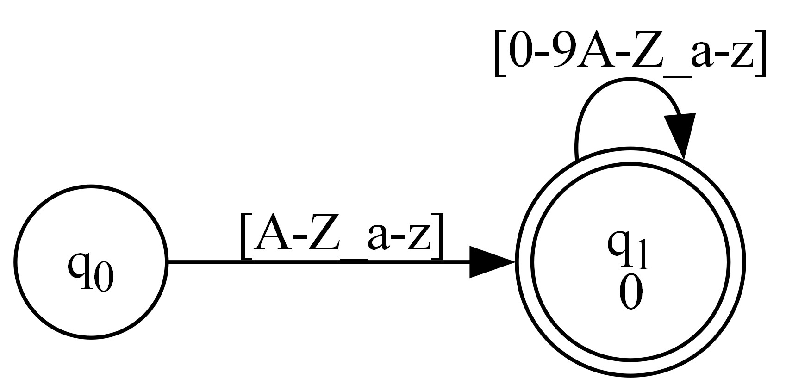
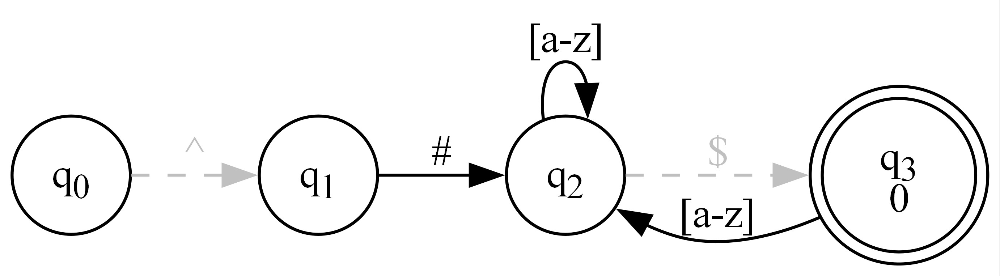

# Luthor

A fast, compact lexer generator that produces simple integer arrays for efficient text matching in any programming language.

This project is a C# .NET 8.0 console application that can be installed as a global dotnet tool.
It also ships with luthor.py which is a pure Python implementation of the same algorithms, so you can use it without .NET.
For C# projects there is also **Luthor.Generator**, a NuGet package that builds the lexer at compile time from attributes on a partial class (see [Source Generator](#source-generator-luthorgenerator)).

**Key Features:**
- Direct-to-DFA conversion (no intermediate NFA)
- Partial lazy quantifier support (`??`, `*?`, `+?`) - all expressions are accepted but due to limitations of DFA traversal some complicated lazy matches may end up partly or entirely greedy.
- Unicode support (UTF-8, UTF-16, UTF-32)
- Compact array output suitable for embedded systems
- Language-agnostic - use the arrays in C, C++, Rust, etc.
- C# source generator - declare rules as attributes and get a ready-to-use lexer class, with no build step to run by hand

## What Luthor Does

Luthor takes regular expressions or lexer grammars and converts them into simple integer arrays that can be embedded in any program. Instead of shipping a complex regex engine, you get a small array that can be walked with a simple matching loop.

**Example:** The pattern `[A-Za-z_][A-Za-z0-9_]*` becomes:
```c
int dfa[] = {10, -1, -1, -1, 3, 65, 90, 14, 95, 95, 14, 97, 122, 14, 0, -1, -1, 4, 48, 57, 14, 65, 90, 14, 95, 95, 14, 97, 122, 14};
```

## Technical Background

Luthor implements several advanced algorithms:

- Direct-to-DFA construction using the Aho-Sethi-Ullman algorithm (Dragon Book)
- Lazy matching using Dr. Robert van Engelen's algorithm from RE/FLEX
- Unicode range splitting for efficient multi-byte encoding support

## Acknowledgements

Special thanks to Dr. Robert van Engelen for his guidance on implementing lazy matching in pure DFA form.

## Quick Start

### Installation

```bash
dotnet tool install luthor-tool -g
```

### Basic Usage
```
# Single expression
luthor "[0-9]+"
```
### Lexer from file
```bash
luthor mylexer.lex
```

### Options

```
luthor <rules-file|pattern> [--encoding <encoding>] [--no-error] [--unicode] [--graph <graph-file>] [--vertical] [--dpi <dpi>]
```

| Option | Meaning |
|---|---|
| `-e`, `--encoding <encoding>` | Encoding of the generated table (default UTF-8) |
| `-n`, `--no-error` | Do not generate the [error rule](#the-error-rule) |
| `-u`, `--unicode` | Use Unicode definitions for [character classes](#character-classes) |
| `-g`, `--graph <graph-file>` | Also write a DFA graph; the extension picks the format (`.dot`, `.png`, `.svg`, ...). Needs Graphviz on the PATH for anything but `.dot` |
| `-v`, `--vertical` | Lay the graph out top to bottom |
| `-d`, `--dpi <dpi>` | Graph resolution (default 300) |

`luthor.py` takes the same options: `python luthor.py mylexer.lex --unicode`.

## Source Generator (Luthor.Generator)

Luthor.Generator is a Roslyn incremental source generator. You declare the rules as attributes on a partial class, and the compiler generates the DFA tables and a `Tokenize` method for you. The tables are rebuilt only when the rules change, and nothing extra ships with your app beyond the generated code.

### Installation

```bash
dotnet add package Luthor.Generator
```
The consuming project must target .NET 8 or later. The package is a development dependency: it runs at compile time and adds no runtime assembly to your output.

### Defining a lexer

Put `[Rule]` attributes on a `partial` class. Each rule has a name and a pattern; the name becomes a `public const int` symbol id on the class.

```csharp
using Luthor;

namespace Example;

[Rule("Directive",    @"^#[^\n]*")]
[Rule("LineComment",  @"//[^\n]*")]
[Rule("BlockComment", @"/\*(.|\n)*?\*/")]   // lazy: stops at the first */
[Rule("If",           "if", true)]           // true = literal, no regex metacharacters
[Rule("While",        "while", true)]
[Rule("Ident",        @"[a-zA-Z_][a-zA-Z0-9_]*")]
[Rule("Number",       @"[0-9]+(\.[0-9]+)?")]
[Rule("Ws",           @"[ \t\r\n]+")]
[Rule("Op",           @"[-+*/=<>!;,(){}]")]
partial class Lexer { }
```

- Rules are numbered in the order they are declared (0, 1, 2, ...), and the same priority applies as in a lexer file: when two rules match the same longest text, the earlier one wins. List keywords before `Ident`.
- Patterns use the same syntax as the command-line tool, including [character classes](#character-classes) such as `[[:digit:]]`, `[[:alpha:]_]` and `\p{Upper}`.
- The attributes live in namespace `Luthor` and are generated into your project, so there is nothing else to reference.
- Keep all the `[Rule]` attributes on one declaration of the class. If they are split across partial declarations, priority depends on file order.

### Using it

```csharp
foreach (var (pos, sym, text) in Lexer.Tokenize("while (x < 10) x = x + 1;"))
{
    if (sym == Lexer.Ws) continue;
    Console.WriteLine($"{pos}: {sym} '{text}'");
}

using var reader = File.OpenText("input.c");
foreach (var token in Lexer.Tokenize(reader)) { /* ... */ }
```

Every `Tokenize` overload returns `IEnumerable<(long Position, int Symbol, string Text)>` and works lazily. The `TextReader` and `Stream` overloads buffer only the current token, so large inputs don't need to fit in memory.

| Overload | Position is | Generated when |
|---|---|---|
| `Tokenize(string)` | char index | always |
| `Tokenize(TextReader)` | char offset | always |
| `Tokenize(byte[])` | byte offset | `Encoding` is set |
| `Tokenize(Stream)` | byte offset | `Encoding` is set |

### Options

Add a `[Lexer]` attribute to change the defaults:

```csharp
[Lexer(Encoding = "UTF-8", ErrorRule = true, Unicode = true)]
partial class Lexer { }
```

- **`Unicode`** (default `false`) switches the character classes to their Unicode definitions (see [Character classes](#character-classes)), the same as RE/flex's `%option unicode`. With it, `[[:alpha:]_][[:word:]]*` matches `café` and `Ωμέγα` as single identifiers.
- **`ErrorRule`** (default `true`) adds the [error rule](#the-error-rule) as a constant named `ERROR`, after the last rule. Every unit of input then lands in some token. With `ErrorRule = false`, input no rule matches comes back one code unit at a time with symbol `-1`.
- **`Encoding`** (default none) generates a second table built for that encoding, plus the `byte[]` and `Stream` overloads. These match directly on the encoded bytes without decoding them first, and skip a leading byte order mark. Accepted values:
  - `UTF-8`
  - `UTF-16`, `UTF-16LE` or `UTF-16BE`
  - `UTF-32`, `UTF-32LE` or `UTF-32BE`
  - any single-byte code page, by name or number (`latin1`, `windows-1252`, `437`, ...)

  Multi-byte code pages such as Shift-JIS are not supported.

The string and `TextReader` overloads always use a UTF-16 table, since .NET strings are UTF-16.

### Seeing the generated code

To write the generated files to disk, add this to the project file:

```xml
<PropertyGroup>
  <EmitCompilerGeneratedFiles>true</EmitCompilerGeneratedFiles>
</PropertyGroup>
```

They appear under `obj/<Configuration>/<TargetFramework>/generated/Luthor.Generator/`. In Visual Studio you can also find them under **Dependencies → Analyzers → Luthor.Generator**.

There are two kinds of file:

- `LuthorShared.g.cs` is generated once per project. It holds the attributes and the matching code that every lexer in the project shares.
- `<Namespace>.<Class>.g.cs` is generated for each lexer. It holds the symbol constants, the DFA table(s) and the `Tokenize` methods.

### Diagnostics

Mistakes in the rules are reported as compiler errors and warnings on the attribute that caused them:

| Id | Severity | Meaning |
|---|---|---|
| LUTH001 | Error | The class isn't `partial` |
| LUTH002 | Error | A containing class isn't `partial` |
| LUTH003 | Error | A rule's name or pattern isn't a non-null constant string |
| LUTH004 | Error | Bad rule name: not a valid identifier, a duplicate, `ERROR` while the error rule is on, or a clash with the class name or a generated member |
| LUTH005 | Error | The pattern doesn't parse |
| LUTH006 | Warning | The rule can match the empty string (possibly only at `^` or `$`) |
| LUTH007 | Error | Unsupported encoding |
| LUTH008 | Error | Building the DFA failed for another reason |
| LUTH009 | Warning | Rules are split across partial declarations |

## Lexer Input Format

### Single Expression

For a single regular expression, just provide the pattern:

```
luthor "if|while|for"
```

## Lexer Grammar
For a full lexer, create a text file with one rule per line, or empty or comment lines:

```
# C-like Language Lexer
# Comments start with # and must be the first non-whitespace character on the line. Blank lines are ignored.

# Keywords
if|while|for|int|void

# Identifiers  
[A-Za-z_][A-Za-z0-9_]*

# Integers (decimal and hex)
0x[0-9a-fA-F]+|[0-9]+

# C-style comments
/\*(.|\n)*?\*/

# Line comments  
//.*$

# Whitespace (usually ignored)
[ \t\n\r]+
```

### Rules:

- Each expression on its own line
- Comments: `#text` or `#` alone. 
- Accept IDs assigned by line order (0, 1, 2, ...)
- Supports POSIX character classes such as `[[:digit:]]` and `[[:alpha:]]`, and the equivalent `\p{Digit}` and `\p{Alpha}`; see [Character classes](#character-classes)
- Lazy quantifiers: *?, +?, ??, {1,3}? (not quite POSIX due to DFA limitations)

### Character classes

Character classes follow RE/flex. There are 14 named classes. Each can be written inside a bracket list as `[[:name:]]`, or anywhere as `\p{Name}`:

| Bracket form | Escape form | ASCII definition | Unicode definition |
|---|---|---|---|
| `[[:alnum:]]` | `\p{Alnum}` | `[0-9A-Za-z]` | `Ll`, `Lu`, `Nd` |
| `[[:alpha:]]` | `\p{Alpha}` | `[A-Za-z]` | `Ll`, `Lu` |
| `[[:ascii:]]` | `\p{ASCII}` | U+0000–U+007F | same |
| `[[:blank:]]` | `\p{Blank}` | space and tab | same (ASCII) |
| `[[:cntrl:]]` | `\p{Cntrl}` | U+0000–U+001F, U+007F | `Cc`, `Cf` |
| `[[:digit:]]` | `\p{Digit}` | `[0-9]` | `Nd` |
| `[[:graph:]]` | `\p{Graph}` | U+0021–U+007E | everything except `Cc`, `Cf`, `Z` and surrogates |
| `[[:lower:]]` | `\p{Lower}` | `[a-z]` | `Ll` |
| `[[:print:]]` | `\p{Print}` | U+0020–U+007E | everything except `Cc`, `Cf` and surrogates |
| `[[:punct:]]` | `\p{Punct}` | ASCII punctuation | `P` |
| `[[:space:]]` | `\p{Space}` | `[\t\n\v\f\r ]` | `Zs` plus `[\t\n\v\f\r]` |
| `[[:upper:]]` | `\p{Upper}` | `[A-Z]` | `Lu` |
| `[[:word:]]` | `\p{Word}` | `[0-9A-Za-z_]` | `L`, `Nd`, `Pc` |
| `[[:xdigit:]]` | `\p{XDigit}` | `[0-9A-Fa-f]` | same (ASCII) |

- **ASCII is the default.** The Unicode definitions apply in Unicode mode, as with RE/flex's `%option unicode`. Turn it on with `--unicode` on the command line (both `luthor` and `luthor.py`), `[Lexer(Unicode = true)]` in the source generator, or `unicode: true` in `Builder.Build`. Unicode mode also makes `\d`, `\w` and `\s` match `\p{Digit}`, `\p{Word}` and `\p{Space}`. The Unicode tables are generated from `UnicodeData.txt` by `tools/gen_unicode_classes.py`, into `UnicodeClasses.cs` for C# and (with `--python`) into the block at the end of `luthor.py`.
- **Names in brackets:** the first letter can be either case, so `[[:alpha:]]` and `[[:Alpha:]]` are the same. `[[:ALPHA:]]` is an error.
- **Names in `\p{...}`:** these must be written exactly as in the table, so `\p{Alpha}` works but `\p{alpha}` doesn't.
- **Negation:** use `[[:^digit:]]`, `\P{Digit}`, `\p{^Digit}` or `[^[:digit:]]`.
- **Combining:** classes can be mixed with other items in a bracket list, as in `[[:alpha:]_]` or `[\p{Upper}\p{Digit}]`.
- **Outside brackets:** `[:alpha:]` on its own is an ordinary bracket list of the characters `:`, `a`, `l`, `p` and `h`, as in POSIX.

### Array Format

A compiled lexer is a single flat `int[]`. States are stored back to back, and every reference to a state is simply its index in the array, so the array can be embedded as-is: no decoding, no pointers, no fix-ups. `-1` always means "none".

#### Header

| Index | Meaning |
|---|---|
| `dfa[0]` | The newline code unit in the table's encoding, used by `^` and `$` (10 for UTF-8/16/32; 37 for EBCDIC; `-1` if the encoding has none) |
| `dfa[1]` | The start state begins here |

#### State record

Each state is `4 + 3n` ints:

| Offset | Field | Meaning |
|---|---|---|
| `+0` | `accept` | Accept id (the rule's line number, starting at 0) if the state accepts, else `-1` |
| `+1` | `bol` | State reached through a `^` anchor, or `-1` |
| `+2` | `eol` | State reached through a `$` anchor, or `-1` |
| `+3` | `n` | Number of transition ranges |
| `+4`… | `min, max, target` | `n` triples. Code units `min` through `max` (inclusive) go to the state at index `target` |

The ranges of a state are sorted by `min` and never overlap, so a matcher can stop scanning as soon as a range starts above the current code unit, or binary-search states with many ranges. When two rules match the same text, the lower accept id wins; that is decided when the table is built, so the matcher never has to.

#### Code units and encodings

The table works on code units, never on decoded characters. The input must be in the encoding the table was generated for:

| Encoding | One step of the matcher reads | Range of values |
|---|---|---|
| UTF-8 | one byte | 0–255 |
| UTF-16 | one `char` (a supplementary character is two steps: its surrogate pair) | 0–65535 |
| UTF-32 | one codepoint | 0–1114111 |
| Single-byte code pages (ASCII, ISO-8859-x, Windows-125x, EBCDIC) | one byte | 0–255 |

Multi-unit characters are handled by extra intermediate states inside the table, so the matcher never decodes anything. A UTF-8 table can be walked over raw bytes in C with no Unicode library.

#### Example walkthrough

`[A-Za-z_][A-Za-z0-9_]*` in UTF-8:

```
index  0: 10                                   newline is 10
index  1: -1, -1, -1, 3,                       state 1 (start): not accepting, no anchors, 3 ranges
          65, 90, 14,                            'A'-'Z' -> state 14
          95, 95, 14,                            '_'     -> state 14
          97, 122, 14                            'a'-'z' -> state 14
index 14:  0, -1, -1, 4,                       state 14: accepts id 0, no anchors, 4 ranges
          48, 57, 14,                            '0'-'9' -> state 14
          65, 90, 14,                            'A'-'Z' -> state 14
          95, 95, 14,                            '_'     -> state 14
          97, 122, 14                            'a'-'z' -> state 14
```


Matching `foo_1 bar`: start at state 1; `f` moves to state 14 (accepting, so remember "id 0, length 1"); `o`, `o`, `_` and `1` stay in state 14, each time remembering the longer match; the space matches no range, so matching stops. The result is the last remembered match: id 0, length 5.

#### Anchors

`^` and `$` are zero-width, so they are not ranges. They are the `bol` and `eol` fields: extra edges that the matcher takes without consuming input. Here is `^#[a-z]*$`:

```
index  0: 10
index  1: -1,  5, -1, 0          start: only reachable through ^, so bol -> 5 and no ranges
index  5: -1, -1, -1, 1,  35, 35, 12            '#' -> 12
index 12: -1, -1, 19, 1,  97, 122, 12           'a'-'z' -> 12; at a line end, eol -> 19
index 19:  0, -1, -1, 1,  97, 122, 12           accepts id 0; 'a'-'z' -> 12
```


Before each step the matcher:

1. takes `bol` if it is at the start of a line: the first unit of the input, or right after a newline;
2. then takes `eol` if the next unit is the newline (`dfa[0]`) or there is no more input;
3. then checks `accept`.

Taking an anchor edge keeps every other possibility alive. That is why state 19 still has the `a`-`z` range: a state reached through `$` can go on consuming input for rules that don't end there. A lexer has to tell the matcher whether each token starts at the beginning of a line. The examples below take this as `at_line_start`.

#### Lazy quantifiers

Lazy matching is resolved entirely when the table is built. There is nothing for the matcher to do. Compare `a.*b` and `a.*?b` (UTF-32):

```
a.*b    ... index 24:  0, -1, -1, 4,  0, 9, 8,  11, 97, 8,  98, 98, 24,  99, 1114111, 8
a.*?b   ... index 24:  0, -1, -1, 0
```

The tables are identical except for the accepting state. In the lazy table it has no ranges left, so the match ends at the first `b` instead of the last one.

#### Matching loop

Every traversal follows the same steps:

1. Start at `state = 1`, with `accept = -1`.
2. Take the `bol` and `eol` edges as described above.
3. If `dfa[state] != -1`, remember it and the current length.
4. Find the range containing the next code unit. If there is none, or the input is exhausted, stop.
5. Move to its `target` and repeat from step 2.

The result is the last remembered accept id and length. A length of 0 means nothing matched. Tables built with the error rule (below) never return that except at the end of input.

**C** (UTF-8 or single-byte tables)

```c
#include <stddef.h>

/* Longest match at the start of s[0..n). Returns the accept id, or -1 if nothing matched.
   *len receives the match length in code units. at_line_start: 1 if s[0] begins a line. */
int luthor_match(const int *dfa, const unsigned char *s, size_t n, int at_line_start, size_t *len)
{
    int state = 1, accept = -1, bol = at_line_start;
    size_t i = 0;
    *len = 0;
    for (;;) {
        if (bol && dfa[state + 1] != -1) state = dfa[state + 1];                        /* ^ */
        if ((i == n || s[i] == dfa[0]) && dfa[state + 2] != -1) state = dfa[state + 2];  /* $ */
        if (dfa[state] != -1) { accept = dfa[state]; *len = i; }
        if (i == n) break;
        int c = s[i], next = -1;
        const int *r = dfa + state + 4;
        for (int k = 0; k < dfa[state + 3] && c >= r[0]; k++, r += 3)
            if (c <= r[1]) { next = r[2]; break; }
        if (next == -1) break;
        state = next;
        bol = (c == dfa[0]);
        i++;
    }
    return accept;
}
```

**C#** (UTF-16 tables)

```csharp
internal static class LuthorDfa
{
    // Longest match at text[pos..]. Returns (accept id or -1, length in code units).
    // This version reads UTF-16 chars; for a UTF-8 table use ReadOnlySpan<byte> instead.
    internal static (int Accept, int Length) Match(int[] dfa, ReadOnlySpan<char> text, int pos = 0, bool atLineStart = true)
    {
        int state = 1, accept = -1, length = 0, i = pos;
        bool bol = atLineStart;
        while (true)
        {
            if (bol && dfa[state + 1] != -1) state = dfa[state + 1];                                    // ^
            if ((i == text.Length || text[i] == dfa[0]) && dfa[state + 2] != -1) state = dfa[state + 2]; // $
            if (dfa[state] != -1) { accept = dfa[state]; length = i - pos; }
            if (i == text.Length) break;
            int c = text[i], next = -1, r = state + 4;
            for (int k = 0; k < dfa[state + 3] && c >= dfa[r]; k++, r += 3)
                if (c <= dfa[r + 1]) { next = dfa[r + 2]; break; }
            if (next == -1) break;
            state = next;
            bol = c == dfa[0];
            i++;
        }
        return (accept, length);
    }
}
```

**Python** (any table, given a sequence of code units)

```python
def luthor_match(dfa, units, pos=0, at_line_start=True):
    """Longest match at units[pos:]. units is a sequence of ints (code units):
    bytes for UTF-8 tables, [ord(c) for c in s] for UTF-32 tables.
    Returns (accept id or -1, length)."""
    state, accept, length, i, bol = 1, -1, 0, pos, at_line_start
    while True:
        if bol and dfa[state + 1] != -1:                                        # ^
            state = dfa[state + 1]
        if (i == len(units) or units[i] == dfa[0]) and dfa[state + 2] != -1:    # $
            state = dfa[state + 2]
        if dfa[state] != -1:
            accept, length = dfa[state], i - pos
        if i == len(units):
            break
        c, nxt, r = units[i], -1, state + 4
        for _ in range(dfa[state + 3]):
            if c < dfa[r]:
                break
            if c <= dfa[r + 1]:
                nxt = dfa[r + 2]
                break
            r += 3
        if nxt == -1:
            break
        state, bol, i = nxt, c == dfa[0], i + 1
    return accept, length
```

In Python, pass `text.encode("utf-8")` for a UTF-8 table (indexing `bytes` gives ints), or `[ord(c) for c in text]` for a UTF-32 table.

#### The error rule

Tables are built with a catch-all rule at the lowest priority. It gets the accept id after the last rule, and it matches exactly one character wherever no other rule matches. Any code unit that can't start a valid character also becomes an error token of its own. That covers invalid UTF-8 bytes, lone surrogates in UTF-16, values above U+10FFFF in UTF-32, and bytes a code page doesn't define. A truncated multi-byte sequence becomes a single error token covering the units that were read.

With the error rule, every position in the input produces a token of length at least 1. On valid input, error tokens always cover whole characters (for example, both bytes of `é` in UTF-8). A lexer never has to decide how far to skip; it just advances by the match length and treats the error id like any other token:

```c
size_t pos = 0, len;
while (pos < n) {
    int at_line_start = pos == 0 || s[pos - 1] == dfa[0];
    int id = luthor_match(dfa, s + pos, n - pos, at_line_start, &len);
    /* token `id` is s[pos .. pos + len); id == number of rules means "error" */
    pos += len;
}
```

The error rule never changes what the other rules match. It only fills in the positions where they match nothing, and when it ties with another rule, the other rule wins. It makes tables somewhat larger (about a third, for the C-like lexer used in the examples), mostly because the start state gains ranges that cover every gap.

## Delazy

Delazy is a companion tool that takes a regular expression and replaces any lazy quantifiers with greedy ones. It is more of a curiousity than practical, but it may be useful for testing or for generating an expression that can be used with a standard DFA engine. There is no python port, and it's not shipped as a dotnet tool, but you can build it from the source in the `delazy` folder.